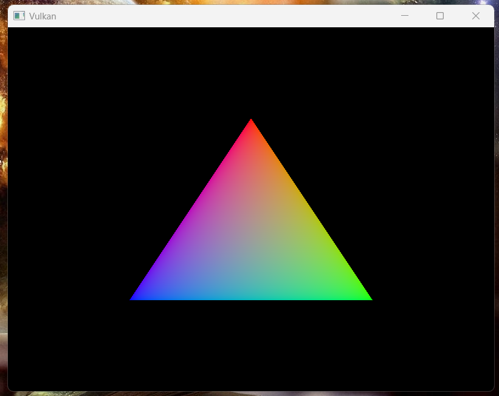

# Vulkan Wrapper

- Personal Vulkan Wrapper
- Removes need for boilerplate code for Vulkan 3D Graphics Programming and simplifying the process of creating Vulkan objects with default configurations. 
- The wrapper allows for overriding defaults such as to keep Vulkan's customizability.

## HelloTriangle Example built using VKW

## Requirements for use
- Install [Vulkan SDK](https://vulkan.lunarg.com/sdk/home)
- Install [GLM](https://github.com/g-truc/glm)
- Install [GLFW](https://www.glfw.org/download)